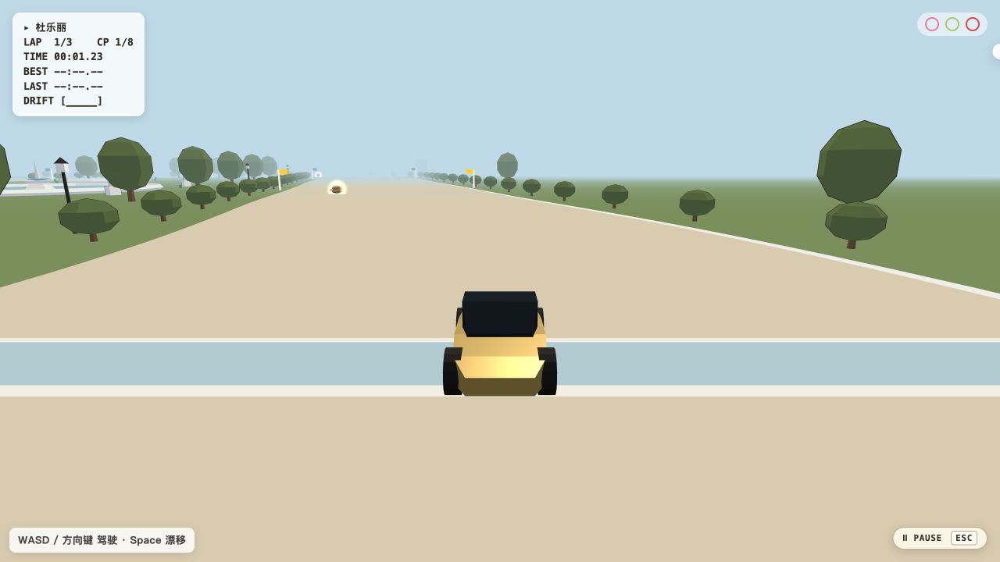

# Freja Ren

**Seeking Summer 2027 Software Engineering Internships**  
Backend · Cloud & Infrastructure · Full-Stack | Bay Area, California

I build backend systems and interactive applications, with a focus on data correctness,
failure recovery, and clear user experiences.

## Selected projects

### [MetroRide](https://github.com/96528025/MetroRide) · Event-driven backend

A ride-dispatch backend with six core Go services and an optional Java fare service.
**Duplicate-safe processing** combines a transactional outbox with guarded state changes
and a balanced fare ledger. Recovery tests and a Helm deployment in CI exercise the system.

`Go` `Java / Spring Boot` `PostgreSQL` `Redis Streams` `Docker` `Kubernetes / Helm`

[Architecture & verification](https://github.com/96528025/MetroRide#readme)

### [Distributed KV](https://github.com/96528025/distributed-kv) · Replication & recovery

A three-process, Raft-style key-value store built with Python's standard library.
**Correctness under failure** is the focus: 152 checks cover replication, leader suspension,
crashes, restart, and storage corruption. The implemented Raft subset and open safety gaps
are documented alongside the results.

`Python` `Replicated logs` `WAL` `Checkpoints` `Failure injection`

[Architecture](https://github.com/96528025/distributed-kv/blob/main/docs/ARCHITECTURE.md) ·
[Correctness investigations](https://github.com/96528025/distributed-kv/blob/main/docs/RAFT_CORRECTNESS.md)

### [Nearby 10-Minute Map](https://github.com/96528025/nearby-10min-map) · Geospatial full-stack app

Explore a destination's model-estimated ten-minute driving area and nearby facilities.
**One routed boundary drives both the map and result filtering**, replacing a circle
approximation after a five-location benchmark. Background enrichment and degraded modes
keep results useful when external data is incomplete.

`React` `TypeScript` `FastAPI` `Leaflet` `Docker / Render`

[Try the map](https://nearby-10min-map.onrender.com/) ·
[Implementation & benchmark](https://github.com/96528025/nearby-10min-map#readme)

### [AI Roundtable](https://github.com/96528025/ai-roundtable) · Full-stack AI workflow

Turn a product idea into a decision brief, MVP scope, and validation plan.
**Evaluation informed a simpler design:** the default Planner → Writer workflow replaced
a fixed 16-call roundtable. Runtime validation and a shared four-attempt budget bound
output recovery and retries. The public demo is sample-only.

`TypeScript` `Next.js / React` `Node.js` `Vitest / Playwright` `Vercel`

[View the sample](https://ai-roundtable-mu.vercel.app/) ·
[Evaluation & methodology](https://github.com/96528025/ai-roundtable#evaluation-what-changed-and-what-the-evidence-supports)

### [Paris Kart](https://fj-paris-kart.netlify.app/) · Interactive 3D systems

A playable browser kart racer with three-lap races, drifting, power-ups, and pause/restart.
**Paris Kart is the playable release; SF Circuit v1 is an unreleased track prototype that uses the same vehicle and collision code for simulation testing.**

`JavaScript` `Three.js` `GLSL` `Vite` `Simulation tooling`

[Play Paris Kart](https://fj-paris-kart.netlify.app/)

## See the projects

| Nearby 10-Minute Map | Paris Kart |
| --- | --- |
|  |  |
| Bundled Apple Park view: recorded driving area and nearby facilities. | Playable Paris release: three laps, drifting, and power-ups. |

## Open source & research

- **NVIDIA/NemoClaw:** [merged installation-troubleshooting documentation, PR #378](https://github.com/NVIDIA/NemoClaw/pull/378).
- **Research:** co-author of [A Comparison of LLM Finetuning Methods & Evaluation Metrics with Travel Chatbot Use Case](https://arxiv.org/abs/2408.03562) (arXiv, 2024; author name **Angel Ren**).

[All repositories](https://github.com/96528025?tab=repositories)
